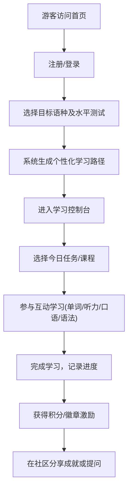

## 1. 产品概述
一款支持多语种（英语、日语、韩语等主流语言）学习的在线教育平台。
- 致力于打造沉浸式的语言学习体验，通过互动模块和个性化推荐解决用户学习语言的痛点，帮助用户高效提升外语能力。
- 目标群体为语言学习爱好者、备考人群及职场人士。

## 2. 核心功能

### 2.1 用户角色
| 角色 | 注册方式 | 核心权限 |
|------|----------|----------|
| 游客 | 无 | 浏览首页介绍、部分公开试听课程 |
| 普通用户 | 邮箱/手机号注册 | 学习课程、使用互动模块、参与社区交流、进度追踪 |
| 管理员 | 后台添加 | 管理课程内容、管理用户和社区、查看平台数据 |

### 2.2 功能模块
1. **认证模块**：用户注册、登录、找回密码。
2. **学习中心**：分级课程体系展示、个性化学习路径推荐、学习进度追踪。
3. **互动学习模块**：单词记忆（卡片式）、语法练习（填空/选择）、口语跟读（录音对比）、听力训练。
4. **社区与激励模块**：用户交流论坛、成就系统（徽章、积分排行榜）。

### 2.3 页面详情
| 页面名称 | 模块名称 | 功能描述 |
|----------|----------|----------|
| 首页 | 英雄区域 | 平台标语、多语种选择入口、动态沉浸式背景 |
| | 特色介绍 | 展示平台互动学习模块和个性化推荐的优势 |
| 认证页 | 登录/注册 | 支持账号密码登录、表单验证 |
| 学习控制台 | 进度看板 | 展示当前学习语种、整体进度、每日学习打卡状态 |
| | 推荐路径 | 基于用户水平推荐的课程及每日任务 |
| 课程列表页 | 分级筛选 | 按语种、难度级别（如A1-C2）筛选课程 |
| 互动学习页 | 练习组件 | 提供单词卡片、听力播放器、口语录音与评分UI、语法题目 |
| 社区论坛页 | 交流列表 | 帖子列表、发布帖子、点赞评论功能 |
| 个人中心页 | 成就展示 | 展示获取的徽章、积分及学习统计图表 |

## 3. 核心流程
用户从注册登录到完成一次学习打卡的完整流程。

## 4. 用户界面设计
### 4.1 设计风格
- **主色调与辅助色**：采用现代科技感的深蓝（#0f172a）为主背景，辅以充满活力的渐变色（如紫红到亮橙 #ec4899 to #f97316）作为高亮和强调色，打造沉浸式、前沿的学习氛围。
- **按钮样式**：圆角按钮（rounded-full 或 rounded-xl），具有悬浮发光效果和微小缩放动画，提升互动感。
- **字体与大小**：标题使用无衬线现代字体（如 Inter, Space Grotesk），正文要求易读性强，字号层次分明。
- **布局风格**：卡片式布局为主，大量使用毛玻璃（Glassmorphism）效果、暗色模式、留白，以减轻认知负担。
- **图标/表情风格**：使用生动的 3D 风格图标或高质量的现代线性图标，配合细致的微交互动画。

### 4.2 页面设计概览
| 页面名称 | 模块名称 | UI 元素 |
|----------|----------|---------|
| 首页 | 英雄区域 | 大胆的排版，沉浸式动画背景（例如漂浮的语言字符），毛玻璃效果的导航栏 |
| 学习控制台 | 进度看板 | 环形进度条、数据统计图表卡片、柔和的阴影与渐变高亮 |
| 互动学习页 | 单词卡片 | 3D翻转效果卡片、操作按钮（认识/不认识）、清晰的音标与释义排版 |
| 个人中心 | 成就墙 | 发光的徽章图标、网格布局的成就卡片、流光效果的进度提示 |

### 4.3 响应式设计
采用桌面端优先（Desktop-first）设计，平滑过渡至移动端自适应布局。移动端优化手势操作（如卡片左右滑动），确保录音和播放控件在触屏上易于点击。