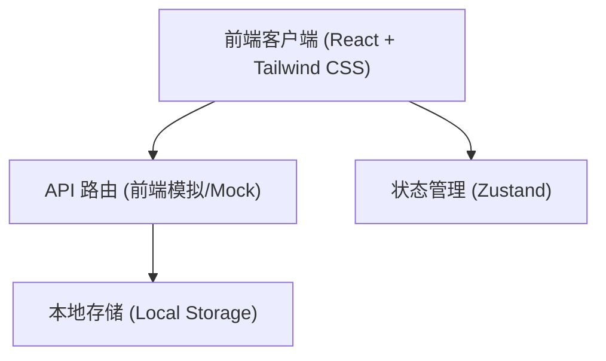
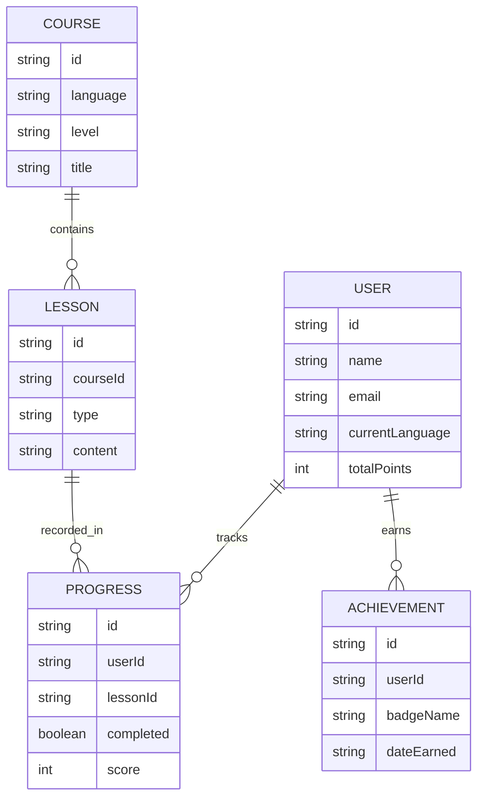

## 1. 架构设计


## 2. 技术说明
- **前端框架**: React@18 + Vite
- **样式方案**: Tailwind CSS v3 + Framer Motion (用于沉浸式动画和微交互)
- **路由管理**: React Router v6
- **状态管理**: Zustand
- **图标组件**: Lucide React
- **初始化工具**: vite

## 3. 路由定义
| 路由 | 目的 |
|------|------|
| `/` | 平台首页及落地页 |
| `/login` | 登录与注册页面 |
| `/dashboard` | 学习控制台，展示进度与推荐路径 |
| `/courses` | 分级课程列表页 |
| `/learn/:courseId` | 互动学习页（含单词、听力、口语模块） |
| `/community` | 社区交流与论坛页 |
| `/profile` | 个人中心与成就激励展示页 |

## 4. API 定义 (前端 Mock 服务)
```typescript
// 用户接口
interface User {
  id: string;
  name: string;
  email: string;
  avatar: string;
  currentLanguage: string;
  level: string;
  points: number;
}

// 课程接口
interface Course {
  id: string;
  language: 'en' | 'ja' | 'ko';
  level: 'A1' | 'A2' | 'B1' | 'B2' | 'C1' | 'C2';
  title: string;
  description: string;
  thumbnail: string;
  totalLessons: number;
}

// 进度接口
interface Progress {
  userId: string;
  courseId: string;
  completedLessons: number;
  lastStudyDate: string;
}
```

## 5. 数据模型
### 5.1 数据模型定义

