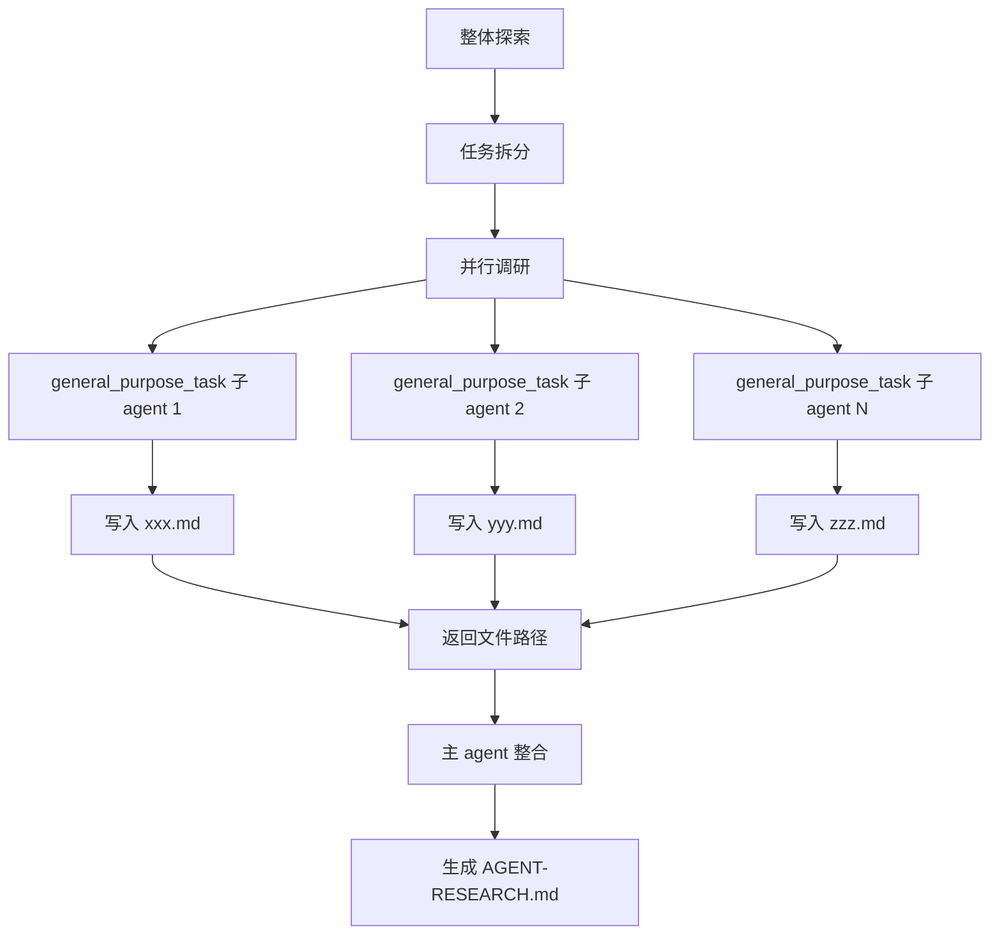

# Agent 架构深度调研技能

对 LLM Agent 系统进行深度调研，输出到 `./.trae/documents` 目录下。

---

## 调研工作流



1. **整体探索**：通读项目 README、配置文件、目录结构，识别 Agent 核心入口和主要功能模块
2. **任务拆分**：根据项目实际情况，拆分出具体的调研方向任务列表
3. **并行调研**：对每个调研任务，拉起独立的 `general_purpose_task` 子 agent 进行深入探索
   - 在子 agent 的 query 中，要求子 agent 先阅读 `.trae/skills/agent-research/SKILL.md` 了解调研规范
   - 明确告知子 agent 当前负责的具体调研方向（如"你负责调研 Agent Loop 机制"）
   - 子 agent 完成调研后，将详细内容写入 `./.trae/documents/` 下对应的 Markdown 文件
   - 子 agent 返回生成文件的路径给主 agent
4. **整合输出**：主 agent 汇总所有子 agent 返回的文件路径，生成 `AGENT-RESEARCH.md` 作为索引文档

### 子 agent 调用示例

```
Task(
  subagent_type: "general_purpose_task",
  description: "调研 Agent Loop",
  query: "先阅读 .trae/skills/agent-research/SKILL.md 了解调研规范和输出格式。
          你当前负责调研【Agent Loop】机制。
          按照 SKILL.md 中的子文档结构，深入探索该机制的实现细节，
          完成后将内容写入 .trae/documents/agent-loop.md，
          最后返回生成的文件路径。"
)
```

---

## 输出规范

**输出目录**：`./.trae/documents/`

**样例文件结构（非实际必须，仅作为参考）**：
```
.trae/documents/
├── AGENT-RESEARCH.md      # 主文档（索引 + 概述）
├── agent-loop.md          # Agent Loop 详细分析
├── tool-system.md         # 工具系统详细分析
├── context-management.md  # Context 管理详细分析
└── ...                    # 其他机制文档
```

**主文档结构**（AGENT-RESEARCH.md）：

```markdown
# [项目名称] Agent 架构调研

> 调研时间：YYYY-MM-DD

## 项目概述
[一段话说明项目定位]

## 整体架构
[Mermaid 架构图 + 简要说明]

## 核心机制索引

| 机制 | 文档 | 简要说明 |
|------|------|----------|
| Agent Loop | [agent-loop.md](./agent-loop.md) | 核心执行循环 |
| 工具系统 | [tool-system.md](./tool-system.md) | 工具定义与执行 |
| ... | ... | ... |

## 项目亮点
[3-5 个值得借鉴的设计]
```

**子文档结构**（各机制详细分析）：

```markdown
# [机制名称]

## 概述
[机制的作用和定位]

## 架构/流程
[Mermaid 图 + 详细说明]

## 关键代码
[文件路径 + 代码片段]

## 设计要点
[实现细节 + 边界情况]

## 亮点
[值得借鉴之处]
```

---

## 调研方向

在核心机制的部分，根据项目实际情况选择相关方向进行调研：

#### Agent 架构
识别项目 Agent 架构设计所采用的模式，常见模式包括：
- **ReAct**：Reasoning + Acting 循环，思考-行动-观察的迭代模式
- **Plan-and-Execute**：先规划任务步骤，再逐步执行
- **Multi-Agent**：多个专业 Agent 协作，每个 Agent 负责特定任务，协调完成复杂项目
- **Workflow**：预定义的流程图，节点间有明确的流转逻辑
- **Hierarchical**：分层架构，高层 Agent 分解任务给低层 Agent

关注项目属于哪种模式、架构的设计细节、设计重点和思路。

#### Agent Loop
ReAct Agent 的核心执行循环，负责接收输入、调用 LLM、处理工具调用、返回响应。重点关注：单次请求涉及多少次 LLM 调用、工具调用后如何继续执行、错误如何处理和重试。

#### System Prompt
定义 Agent 行为的核心，决定了 Agent 的能力边界和行为风格。关注 Prompt 的静态部分和动态部分，以及动态注入的机制。

#### 工具系统
Agent 能力的扩展点，决定了 Agent 能做什么。关注工具的定义方式（Schema 格式）、注册机制、执行流程（同步/异步）、结果如何返回给 LLM。

#### Context
Context 是 Agent 效果的核心来源，提供了合理的 Context 后 Agent 才能达成最佳效果。关注 Context 类型，由哪些部分组成、各部分占比，以及 Agent 如何突出重点 Context、如何引导模型更有效地使用 Context。

#### 对话历史管理
维护对话连续性的基础。关注历史的存储格式、持久化方式。此外，所有 Agent 都必须面对 Context Window 是有限的这一问题，关注历史会话过长时的处理策略（裁剪、压缩、截断、摘要）及其他的特殊历史消息拼接逻辑。

#### Session 管理
多会话场景的基础，区分不同用户/对话。关注 Session 的唯一标识规则、数据隔离机制、生命周期管理。

#### Memory 系统
高级 Agent 的扩展能力，实现跨会话的长期记忆。关注 Memory 的类型、存储结构、写入时机、检索机制。

#### 优化机制
任何提升性能和降低成本的策略。包括但不限于 Prompt Caching、内容裁剪（Pruning）、成本控制策略等关联内容

---

## 调研风格

1. **使用 Mermaid 图表**：尽可能多使用 Mermaid 图表来进行辅助描述
2. **标注代码引用**：提供关键文件和函数位置，适当引用代码内容
3. **关注实现细节**：在描述机制时，不单单关注表面的大致功能实现，还要详细描述探索得到的实现细节
4. **追问边界情况**：不满足于表面理解，思考边界条件下的产品能力表现
5. **发掘亮点**：关注做得好的地方，总结设计智慧，提供可以参考的、可以实践落地的 Agent 设计建议
6. **用户需求优先**：如果用户额外指定需要研究的部分，则对其进行扩展描述

---

## 常用问题模板

**理解机制**：
- "XXX 的完整流程是什么？"
- "XXX 是同步还是异步的？"
- "XXX 的代码在哪里？"

**边界情况**：
- "如果 XXX 没有发生，会怎样？"
- "XXX 超限/失败时如何处理？"

**亮点发掘**：
- "这个设计有什么独特之处？"
- "为什么选择这种方案？"